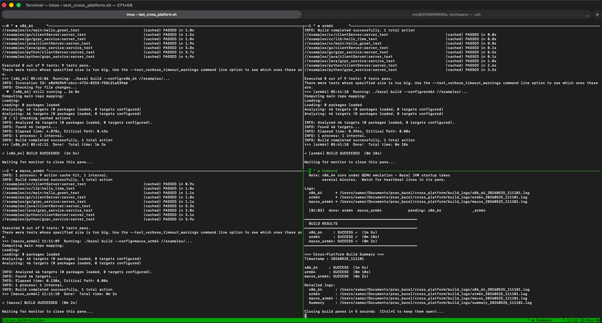

## Bazel Version Management

The required Bazel version is pinned in **`.bazelversion`** (currently `9.0.1`).

The project ships a `./bazel` wrapper script — use it instead of a system `bazel`:

```bash
./bazel build --config=macos_arm64 //examples/cc:hello
./bazel version
```

On first use the script downloads the exact Bazel binary declared in `.bazelversion`, caches it in `~/.cache/bazel-versions/`, and execs it. Subsequent invocations use the cache directly (no network). The script auto-detects OS and CPU (`darwin/linux`, `arm64/x86_64`).

To upgrade the project's Bazel version: edit `.bazelversion`, then run `./bazel` — the new version is downloaded automatically.

## Overview

This is a Bazel cross-compilation toolchain setup. All toolchains are downloaded — no host compiler is used. The project uses **Bzlmod** (`MODULE.bazel`) for dependency and toolchain management.

Supported exec × target combinations:

| Exec platform | Target platform | Compiler | Source |
|---------------|-----------------|----------|--------|
| Linux x86_64 | Linux x86_64 | GCC 9 Bootlin `x86-64--glibc--stable-2024.02-1` | toolchains.bootlin.com |
| Linux x86_64 | Linux ARM64 | GCC 9.2 ARM cross-compiler `gcc-arm-9.2-2019.12-x86_64-aarch64-none-linux-gnu` | developer.arm.com |
| Linux aarch64 | Linux ARM64 | ARM GNU GCC 14.2.rel1 `aarch64-aarch64-none-linux-gnu` | developer.arm.com |
| Linux aarch64 | Linux x86_64 | GCC 12 (Ubuntu 22.04 arm64 packages) + Bootlin x86_64 sysroot | ports.ubuntu.com + toolchains.bootlin.com |
| Linux x86_64 | macOS ARM64 | LLVM 18.1.8 `clang+llvm-18.1.8-x86_64-linux-gnu` | github.com/llvm/llvm-project |
| Linux x86_64 | macOS x86_64 | LLVM 18.1.8 `clang+llvm-18.1.8-x86_64-linux-gnu` | github.com/llvm/llvm-project |
| Linux aarch64 | macOS ARM64 | LLVM 18.1.8 `clang+llvm-18.1.8-aarch64-linux-gnu` | github.com/llvm/llvm-project |
| Linux aarch64 | macOS x86_64 | LLVM 18.1.8 `clang+llvm-18.1.8-aarch64-linux-gnu` | github.com/llvm/llvm-project |
| macOS ARM64 | macOS ARM64 | LLVM 18.1.8 `clang+llvm-18.1.8-arm64-apple-macos11` | github.com/llvm/llvm-project |
| macOS ARM64 | macOS x86_64 | LLVM 18.1.8 same binary, `-target x86_64-apple-macos10.15` | github.com/llvm/llvm-project |
| macOS x86_64 | macOS x86_64 | LLVM 17.0.6 `clang+llvm-17.0.6-x86_64-apple-darwin22.0` | github.com/llvm/llvm-project |
| macOS x86_64 | macOS ARM64 | LLVM 17.0.6 same binary, `-target arm64-apple-macos12` | github.com/llvm/llvm-project |

**Notes:**
- Linux GCC toolchains are patched after download (sysroot `libc.so` linker scripts rewritten to use `=`-relative paths).
- macOS LLVM toolchains use `-fuse-ld=lld` so `ld64.lld` from the downloaded package is used instead of the host linker.
- The macOS SDK (headers/libs) is detected from the host via `xcrun --show-sdk-path`, or supplied via the `MACOS_SDK_PATH` env var on non-macOS hosts. Apple does not redistribute the SDK separately.
- LLVM 18+ no longer ships macOS x86_64 pre-built binaries; 17.0.6 is the last release that does.
- The Linux aarch64 LLVM (`llvm_linux_aarch64`) bundles `libxml2.so.2` needed by `ld.lld`, either copying it from the host or downloading it from an Ubuntu 22.04 arm64 `.deb` as a hermetic fallback. It is still used for macOS cross-compilation from aarch64 exec machines.
- The aarch64 exec → Linux x86_64 toolchain (`gcc_x86_64_on_aarch64`) assembles GCC 12 from Ubuntu 22.04 arm64 `.deb` packages at repository-fetch time (hermetic, no apt-get). A wrapper script passes `-B` to redirect GCC's internal file search to the extracted repo path.

## Build Commands

Platform and build-mode configs are independent and composable.

```bash
# Linux targets
./bazel build --config=x86_64  //examples/cc:hello   # Linux x86_64
./bazel build --config=arm64   //examples/cc:hello   # Linux ARM64

# macOS targets
./bazel build --config=macos_arm64  //examples/cc:hello   # macOS ARM64
./bazel build --config=macos_x86_64 //examples/cc:hello   # macOS x86_64

# Combine platform + build mode
./bazel build --config=macos_arm64  --config=release //examples/cc:hello
./bazel build --config=x86_64       --config=debug   //examples/cc:hello
./bazel build --config=macos_x86_64 --config=stats   //examples/cc:hello

# Build all targets for a platform
./bazel build --config=macos_arm64 //...

# Run tests
./bazel test --config=macos_arm64 //examples/...
```

### Build modes

| Config | `compilation_mode` | Extra flags | Use for |
|--------|--------------------|-------------|---------|
| *(none)* | `fastbuild` | — | Fast iteration |
| `debug` | `dbg` | `-DDEBUG_BUILD` | Debugging with full symbols |
| `release` | `opt` (`-O2 -DNDEBUG`) | `--strip-all` | Production binaries |
| `stats` | `dbg` | `-pg -DSTATS_ENABLED` | gprof profiling |

The first build downloads and extracts the toolchain archives (~hundreds of MB each). Subsequent builds use the Bazel cache.

### Toolchain selection on Linux (`--extra_toolchains`)

Linux toolchains are pinned per-build via `--extra_toolchains` in `.bazelrc` (not registered globally) so they don't interfere with exec-platform resolution on non-Linux hosts:

- `--config=arm64` adds `gcc_arm64_toolchain` (x86_64 exec) and `gcc_arm64_native_toolchain` (aarch64 exec).
- `--config=x86_64` adds `gcc_x86_64_toolchain` (x86_64 exec) and `gcc_x86_64_on_linux_aarch64_toolchain` (aarch64 exec).

macOS toolchains are registered globally in `MODULE.bazel` and auto-selected by Bazel based on exec+target constraints.

## Parallel Cross-Platform Testing

`test_cross_platform.sh` runs builds and tests for **x86_64**, **arm64** (Linux, in Docker), and **macos_arm64** simultaneously in a 2×2 tmux grid.

```bash
./test_cross_platform.sh
```

**Requirements:** `tmux` and Docker Desktop with multi-arch / `binfmt_misc` support.

**Terminal layout:**

```
┌──────────────┬──────────────┐
│   x86_64     │   arm64      │  ← Docker containers (Linux)
├──────────────┼──────────────┤
│  macos_arm64 │   monitor    │  ← macOS host / status + summary
└──────────────┴──────────────┘
```



**How it works:**

- Linux builds run inside long-lived Docker containers (`cross_build_x86_64`, `cross_build_arm64`). Containers are created on first run, restarted on subsequent runs — never removed — so they are reused across invocations.
- Bazel output caches are persisted in named Docker volumes (`cross_build_x86_64_bazel_cache`, `cross_build_arm64_bazel_cache`) that survive container restarts and Bazel version changes.
- The macOS arm64 build runs natively on the host — no Docker.
- x86_64 runs under QEMU emulation on Apple Silicon. Bazel JVM startup can take several minutes; a heartbeat line is printed every 30 s so the pane stays visibly alive.
- Each arch runs `./setup.sh` first to install required host packages, then executes `./bazel test` followed by `./bazel build` for `//examples/...`.
- Per-arch logs are written to `./build_logs/<arch>_<timestamp>.log`. A summary log is written when all three arches finish.

**Container and volume names** (fixed, no timestamp — same names are reused every run):

| Arch | Container | Cache volume |
|------|-----------|--------------|
| x86_64 | `cross_build_x86_64` | `cross_build_x86_64_bazel_cache` |
| arm64 | `cross_build_arm64` | `cross_build_arm64_bazel_cache` |

### setup.sh

`setup.sh` installs required host packages before building. It is called automatically by `test_cross_platform.sh` and is safe to run multiple times (no-op if all packages are already present). Currently installs `libxml2-dev` (Linux arm64) and `curl` (all Linux).

To add a new requirement, append an entry to `REQUIRED_PACKAGES` inside `setup.sh`:

```bash
"package_name:OS:arch"   # OS: Linux | Darwin | *   arch: arm64 | aarch64 | x86_64 | *
```

## Code Coverage

`coverage_check.sh` measures **patch coverage** — the fraction of lines introduced by the last commit (`HEAD~1..HEAD`) that are exercised by tests — and enforces a configurable minimum threshold.

```bash
# Auto-detect platform, 75% threshold (default)
./coverage_check.sh

# Explicit platform and threshold
./coverage_check.sh --config macos_arm64 --threshold 80

# Keep the lcov report after a passing run
./coverage_check.sh --keep-report
```

**Options:**

| Option | Default | Description |
|--------|---------|-------------|
| `--config <cfg>` | auto-detected | Bazel platform config: `x86_64`, `arm64`, `macos_arm64`, `macos_x86_64` |
| `--threshold <pct>` | `75` | Minimum patch coverage % required per language |
| `--keep-report` | off | Retain the lcov report even on a passing run |

**Supported languages:** C/C++, Java, Go, Python. Only languages with changed files are evaluated; unsupported file types (headers-only changes, generated code) emit a warning and are skipped.

**How it works:**

1. Derives the diff from `git diff HEAD~1..HEAD` (last commit) — no patch file needed.
2. Identifies which languages have changed source files.
3. Runs `bazel query rdeps(//examples/..., set(<changed files>))` to discover precisely which targets depend on the changed files; falls back to broad `//examples/<lang>/...` globs if the query returns nothing.
4. Runs `./bazel coverage --config=<cfg> --combined_report=lcov` on the discovered targets only.
5. Parses the merged lcov report, filters to lines present in the patch, and computes per-language coverage.
6. Exits `0` (PASS) if all languages meet the threshold, `1` (FAIL) otherwise.

**Outputs:**

- `coverage_reports/<timestamp>/merged_coverage.dat` — merged lcov data (deleted on PASS unless `--keep-report`).
- `coverage_reports/<timestamp>/bazel_coverage.log` — raw Bazel output.

**Running coverage for a specific language manually:**

```bash
# C/C++
./bazel coverage --config=macos_arm64 --combined_report=lcov //examples/cc/...

# Java
./bazel coverage --config=macos_arm64 --combined_report=lcov //examples/java/...

# Go
./bazel coverage --config=macos_arm64 --combined_report=lcov //examples/go/...

# Python
./bazel coverage --config=macos_arm64 --combined_report=lcov //examples/python/...
```

The merged lcov report lands at `bazel-out/_coverage/_coverage_report.dat`.

## Affected Server Targets

`affected_server_targets.sh` identifies Bazel targets tagged `server` in `//examples/...` that are **transitively affected** by source-file changes in the last commit (`HEAD~1..HEAD`). Use it to determine which deployable service images need to be rebuilt and redeployed after a commit.

```bash
./affected_server_targets.sh
```

**How it works:**

1. Collects changed source files (`*.go`, `*.py`, `*.java`, `*.cpp`, `*.c`, `*.h`) from `git diff HEAD~1..HEAD`.
2. Runs a `bazel query` to find all targets under `//examples/...` that **transitively depend** on those files and carry the `server` tag:
   ```
   attr(tags, 'server', rdeps(//examples/..., set(<changed files>)))
   ```
3. Prints the list of affected server targets — one per line — suitable for piping into a Docker build or deployment script.

**Tagging a target as deployable:**

Add `tags = ["server"]` to any binary rule whose output is packaged into a Docker image. The two existing server targets in this repo illustrate the pattern:

```python
# examples/go/grpc_server/BUILD
go_binary(
    name = "server",
    srcs = ["main.go"],
    tags = ["server"],
    ...
)

# examples/python/clientServer/BUILD
py_binary(
    name = "server",
    srcs = ["server.py"],
    tags = ["server"],
    ...
)
```

**Exit codes:**

| Code | Meaning |
|------|---------|
| `0` | Success — prints matched targets, or warns that none matched |
| `1` | Error — fewer than 2 commits, or `bazel query` failed |

If no server-tagged targets are transitively affected, the script exits `0` with a warning — this is expected for commits that only touch tests or non-server code.

**Example output** (from a commit touching `examples/go/grpc_server/main.go` and `examples/python/clientServer/server_lib.py`):

```
[affected] Diff: c53c3e3..db11931  (HEAD~1..HEAD)
[affected] Changed source files (2):
    examples/go/grpc_server/main.go
    examples/python/clientServer/server_lib.py

[affected] Running bazel query...
[affected]   Query: attr(tags, 'server', rdeps(//examples/..., set(examples/go/grpc_server/main.go examples/python/clientServer/server_lib.py)))

[affected] Affected server targets (2):
    //examples/go/grpc_server:server
    //examples/python/clientServer:server
```

## Architecture

### Toolchain Registration Flow (Bzlmod)

```
MODULE.bazel
  └── toolchain_extension.bzl  (toolchain_ext module extension)
        └── toolchain_repositories.bzl  (all repository rules)
              ├── toolchain_archive_repository  (generic: download + patch + symlink BUILD)
              ├── gcc_9_x86_64_repository / gcc_9_arm64_repository
              ├── gcc_14_arm64_aarch64_hosted_repository  (ARM GCC 14.2 aarch64-hosted, arm64 target)
              ├── gcc_x86_64_on_aarch64_repository  (Ubuntu GCC 12 arm64-hosted, x86_64 target)
              ├── llvm_macos_arm64/x86_64_repository
              ├── llvm_linux_x86_64_repository
              ├── llvm_linux_aarch64_repository  (custom: also bundles libxml2.so.2)
              ├── macos_sdk_repository  (xcrun / MACOS_SDK_PATH)
              ├── jdk_temurin_21_*_repository  (4 platforms)
              ├── protoc_*_repository  (4 platforms)
              ├── protoc_gen_go_*_repository  (4 platforms)
              ├── protoc_gen_go_grpc_*_repository  (4 platforms)
              ├── protoc_gen_grpc_java_*_repository  (4 platforms)
              ├── grpc_python_plugin_*_repository  (4 platforms)
              └── grpc_java_maven_repositories()  (13 Maven JARs)

BUILD.bazel (root)
  ├── cc_toolchain_config (cc_toolchain_config.bzl)          — Linux GCC toolchains (all Linux targets)
  ├── cc_macos_toolchain_config (macos_toolchain_config.bzl) — macOS LLVM toolchains
  ├── cc_toolchain / toolchain / platform targets
  ├── JDK runtime toolchains (jdk_*_toolchain)
  └── proto_toolchain (proto/proto_toolchain.bzl)

MODULE.bazel
  └── register_toolchains() for macOS CC, proto, and JDK toolchains
```

The `WORKSPACE` file is a stub — all repository and toolchain management has been migrated to Bzlmod.

### Key Files

| File | Purpose |
|------|---------|
| `test_cross_platform.sh` | Parallel build+test runner: x86_64 + arm64 (Docker) + macos_arm64 (host) in a 2×2 tmux grid |
| `coverage_check.sh` | Patch coverage checker: runs `bazel coverage`, filters to last-commit diff lines, enforces threshold |
| `setup.sh` | Installs required host packages before building (idempotent; called by `test_cross_platform.sh`) |
| `toolchain_extension.bzl` | Bzlmod module extension; instantiates all external repos; loaded by `MODULE.bazel` |
| `toolchain_repositories.bzl` | All repository rules: `toolchain_archive_repository`, `macos_sdk_repository`, GCC/LLVM/JDK/protoc/plugin wrappers, `grpc_java_maven_repositories` |
| `external_tool/external_tool_repositories.bzl` | Legacy WORKSPACE helper (retained but not the primary path); calls a subset of repos |
| `external_tool/BUILD.gcc_9_*.bazel` | BUILD files injected into downloaded GCC repos; expose `all_files` filegroup |
| `external_tool/BUILD.llvm_macos.bazel` | BUILD file for macOS LLVM repos |
| `external_tool/BUILD.llvm_linux.bazel` | BUILD file for Linux LLVM repos |
| `external_tool/BUILD.jdk.bazel` | BUILD file for Temurin JDK repos; exposes `:jdk` java_runtime target |
| `external_tool/BUILD.protoc.bazel` | BUILD file for protoc repos; exposes `:protoc` and `:well_known_protos` |
| `external_tool/BUILD.proto_plugin.bazel` | BUILD file for single-binary plugin repos (protoc-gen-go, protoc-gen-grpc-java, etc.) |
| `external_tool/BUILD.maven_jar.bazel` | BUILD file for Maven JAR repos; exposes `:jar` java_import |
| `cc_toolchain_config.bzl` | Starlark rule for all Linux GCC toolchains; derives sysroot from `cpu` attr; optional `gcc_builtin_include_dir` for relocated compilers |
| `macos_toolchain_config.bzl` | Starlark rule for macOS LLVM toolchains; uses `-target`, `-isysroot`, `-fuse-ld=lld` |
| `proto/proto_toolchain.bzl` | Custom proto toolchain rule carrying protoc + gRPC plugin paths |
| `proto/defs.bzl` | `proto_library` and `*_proto_library` macro rules consuming the proto toolchain |
| `python/python_extension.bzl` | Bzlmod extension for the custom hermetic Python toolchain |
| `BUILD.bazel` (root) | Instantiates all toolchain configs, `cc_toolchain`, `toolchain`, `platform`, JDK, and proto toolchain targets |
| `MODULE.bazel` | Declares Bazel deps; wires `toolchain_ext`; `register_toolchains()` for macOS CC + JDK + proto |
| `.bazelrc` | Platform and build-mode config shortcuts; `--extra_toolchains` for Linux |

### Sysroot Convention

**Linux GCC** (`cc_toolchain_config.bzl`) — sysroot subdirectory derived from `cpu` attr:
- `arm64` / `aarch64` → `<sysroot_path>/aarch64-none-linux-gnu/libc`
- anything else → `<sysroot_path>/x86_64-buildroot-linux-gnu/sysroot`

**Exception — `gcc_x86_64_on_aarch64` (aarch64 exec → Linux x86_64)**: compiler binaries come from the Ubuntu GCC 12 repo (`gcc_x86_64_on_aarch64`), but `sysroot_path` points to the Bootlin `gcc_9_x86_64` repo for glibc headers and libs. `gcc_builtin_include_dir` is set to `usr/lib/gcc-cross/x86_64-linux-gnu/12/include` inside the Ubuntu repo so Bazel tracks the versioned GCC internal headers from the relocated compiler installation.

**macOS LLVM** (`macos_toolchain_config.bzl`) — sysroot is the macOS SDK path; passed as `-isysroot`.

### Toolchain Constraints Summary

| Toolchain target name | exec | target |
|-----------------------|------|--------|
| `gcc_x86_64_toolchain` | Linux x86_64 | Linux x86_64 |
| `gcc_arm64_toolchain` | Linux x86_64 | Linux arm64 |
| `gcc_arm64_native_toolchain` | Linux aarch64 | Linux arm64 |
| `gcc_x86_64_on_linux_aarch64_toolchain` | Linux aarch64 | Linux x86_64 |
| `clang_macos_arm64_toolchain` | macOS arm64 | macOS arm64 |
| `clang_macos_x86_64_toolchain` | macOS arm64 | macOS x86_64 |
| `clang_macos_x86_64_on_macos_x86_64_toolchain` | macOS x86_64 | macOS x86_64 |
| `clang_macos_arm64_on_macos_x86_64_toolchain` | macOS x86_64 | macOS arm64 |
| `clang_macos_arm64_on_linux_x86_64_toolchain` | Linux x86_64 | macOS arm64 |
| `clang_macos_x86_64_on_linux_x86_64_toolchain` | Linux x86_64 | macOS x86_64 |
| `clang_macos_arm64_on_linux_aarch64_toolchain` | Linux aarch64 | macOS arm64 |
| `clang_macos_x86_64_on_linux_aarch64_toolchain` | Linux aarch64 | macOS x86_64 |

### Additional Toolchains

**JDK — Temurin 21.0.11+10** (4 repos: `jdk_macos_arm64`, `jdk_macos_x86_64`, `jdk_linux_x86_64`, `jdk_linux_aarch64`):
- Registered globally with higher priority than `local_jdk` so no host JVM is required.
- `.bazelrc` sets `--java_language_version=21 --java_runtime_version=21` globally.
- macOS archives include `Contents/Home` in `strip_prefix` so `bin/java` always lands at the repo root.

**Proto toolchain — protoc 29.3** (4 exec platforms):
- Each proto toolchain bundles: `protoc`, `protoc-gen-go` v1.35.2, `protoc-gen-go-grpc` v1.5.1, `protoc-gen-grpc-java` 1.68.0.
- Registered globally; no `target_compatible_with` since generated sources are not architecture-specific.
- Custom toolchain type at `//proto:toolchain_type`; rules in `proto/defs.bzl`.

**Python toolchain — CPython 3.12**:
- Custom hermetic toolchain in `python/`; downloaded via `python_ext` Bzlmod extension in `MODULE.bazel`.
- `rules_python` is also loaded for the standard `py_*` rules; bootstrap mode set to `script` to avoid requiring a system `python3`.

**Java gRPC Maven JARs** (13 JARs, no rules_jvm_external):
- Downloaded directly via `_maven_jar_repository` rule (Bazel's built-in http downloader).
- Managed by `grpc_java_maven_repositories()` in `toolchain_repositories.bzl`.
- Key constraint: `protoc` 29.x generates code requiring `protobuf-java` 4.x (not 3.x).

## Adding a New Target Architecture

1. Add a repository function in `toolchain_repositories.bzl` pointing to the archive URL.
2. Create `external_tool/BUILD.<arch>.bazel` (copy the existing pattern — expose `all_files`).
3. Call the new function from `toolchain_extension.bzl` and add the name to `use_repo()` in `MODULE.bazel`.
4. Add a `cc_toolchain_config`, `cc_toolchain`, `toolchain`, and `platform` block in `BUILD.bazel`.
5. Extend the appropriate toolchain config `.bzl` file if the new arch needs a different sysroot layout.
6. Add a `--config=<arch>` shortcut in `.bazelrc` with appropriate `--extra_toolchains` if Linux.
